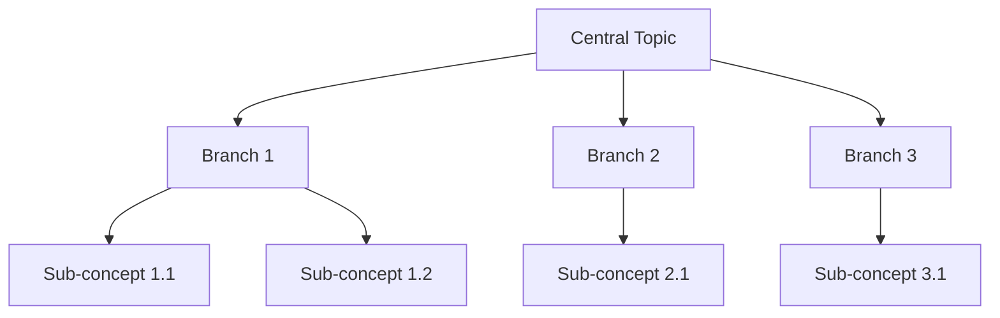

# Mind Map Creation Guide

## Overview

Mind maps visualize knowledge structure, showing relationships between concepts in a hierarchical and intuitive way. They transform linear text into spatial representation, making complex information easier to understand and remember.

**Core principle**: Clarity and logic over visual complexity.

## Mind Map Characteristics

**Strengths**:
- Shows relationships at a glance
- Reveals hierarchical structure
- Aids memory and understanding
- Facilitates brainstorming
- Makes connections visible

**Best for**:
- Organizing reading notes
- Structuring knowledge domains
- Planning content or projects
- Summarizing complex topics
- Connecting disparate ideas

**Not ideal for**:
- Sequential processes (use flowcharts)
- Detailed procedures (use lists)
- Dense information (use outlines)
- Narrative content (use writing)

## Design Philosophy

### Less is More

**Good mind maps**:
- Focus on key concepts (not everything)
- Use 2-5 words per node
- Show 3-4 levels maximum
- Have clear visual hierarchy
- Make relationships obvious

**Avoid**:
- Including every detail
- Long phrases or sentences
- Too many levels (becomes cluttered)
- Unclear relationships
- Visual noise

### Hierarchy Principles

**Levels should represent**:
1. **Central concept**: What's the main topic?
2. **Major branches**: What are the main categories/themes?
3. **Sub-concepts**: What details/examples support each branch?
4. **Details** (optional): Specific items or examples

**Balance**: Each branch should have roughly similar depth.

## Output Formats

Provide mind maps in the format most useful to user:

### Format 1: Text Hierarchy (Default)

**Simple, readable, copy-friendly**

```
Central Topic
│
├─ Branch 1
│  ├─ Sub-concept 1.1
│  │  ├─ Detail
│  │  └─ Detail
│  └─ Sub-concept 1.2
│
├─ Branch 2
│  ├─ Sub-concept 2.1
│  └─ Sub-concept 2.2
│     ├─ Detail
│     └─ Detail
│
└─ Branch 3
   ├─ Sub-concept 3.1
   └─ Sub-concept 3.2
```

**When to use**:
- User wants quick, readable structure
- Will create visual version themselves
- Needs to copy/paste for reference

### Format 2: Mermaid Diagram

**Generates visual diagram code**



**When to use**:
- User wants visual diagram
- Will use in documentation
- Needs shareable format
- Wants to render in tools that support Mermaid

**Note**: Keep labels short (3-5 words max) for readability

### Format 3: Detailed Description

**Explains the map structure in prose**

"This mind map organizes [topic] into three main branches:

1. [Branch 1] covers the foundational concepts...
2. [Branch 2] explores practical applications...
3. [Branch 3] addresses common challenges...

Under [Branch 1], we have [sub-concepts], which..."

**When to use**:
- User wants understanding of structure
- Visual creation isn't possible yet
- Need to explain logic behind organization
- Precursor to actual visualization

## Creating Effective Mind Maps

### Step 1: Identify Central Concept

**The center should be**:
- Clear and specific
- Concise (1-3 words)
- The unifying theme

**Examples**:

✅ Good:
- "Reading Methods"
- "Time Management"
- "Product Thinking"

❌ Too vague:
- "Learning"
- "Work"
- "Ideas"

❌ Too specific:
- "How I Read Books on Sunday Morning"
- "My Time Management System Version 2.0"

### Step 2: Identify Main Branches

**Ask**: What are the natural categories or major themes?

**Aim for 3-6 main branches**:
- Too few (1-2): Probably not enough structure
- Just right (3-6): Clear, balanced structure
- Too many (7+): Consider grouping or sub-maps

**Examples**:

For "Reading Methods":
- Reading Strategies
- Note-Taking Systems
- Retention Techniques
- Application Methods

For "Time Management":
- Planning Tools
- Prioritization
- Focus Techniques
- Energy Management

### Step 3: Develop Sub-Concepts

**Each main branch gets 2-5 sub-concepts**

**Guidelines**:
- Support the parent concept
- Stay at similar level of abstraction
- Use consistent naming patterns
- Keep labels brief

**Example**:

```
Time Management
│
├─ Planning Tools
│  ├─ Daily planning
│  ├─ Weekly review
│  └─ Long-term goals
│
├─ Prioritization
│  ├─ Urgent vs important
│  ├─ Impact assessment
│  └─ Saying no
│
└─ Focus Techniques
   ├─ Pomodoro method
   ├─ Deep work blocks
   └─ Distraction elimination
```

### Step 4: Add Details (Optional)

**Only if needed**. Many mind maps work better with just 3 levels.

**When to add fourth level**:
- Specific examples needed
- Multiple items under sub-concept
- User explicitly wants detail

**When to stop at third level**:
- Structure is already clear
- Adding detail clutters
- Information can live elsewhere

### Step 5: Check Balance

**Review**:
- Each branch has similar depth?
- Labels are consistent length?
- Hierarchy is logical?
- Relationships are clear?
- Nothing is redundant?

**Rebalance if needed**:
- Merge similar branches
- Split overloaded branches
- Move misplaced concepts
- Remove unnecessary details

## Labeling Best Practices

### Node Labels

**Effective labels**:
- 2-5 words maximum
- Noun phrases or key terms
- Scannable at a glance
- Meaningful out of context

**Examples**:

✅ Good:
- "Active reading"
- "Critical thinking"
- "Weekly review"
- "Focus blocks"

❌ Too long:
- "The practice of reading actively"
- "Thinking critically about ideas"
- "Review what happened this week"

❌ Too vague:
- "Method"
- "Technique"
- "Approach"

### Consistency

**Within each level, use similar structures**:

✅ Consistent:
```
Reading Methods
├─ Speed reading
├─ Active reading
└─ Deep reading
```

❌ Inconsistent:
```
Reading Methods
├─ How to read faster
├─ Active reading techniques
└─ Deep
```

## Common Mind Map Patterns

### Pattern 1: Process Breakdown

**Structure**: Major steps → Sub-steps → Details

```
Content Creation
├─ Research
│  ├─ Source gathering
│  └─ Note-taking
├─ Drafting
│  ├─ Outline
│  └─ First draft
└─ Revision
   ├─ Self-edit
   └─ Feedback
```

**Use for**: Workflows, methodologies, procedures

### Pattern 2: Concept Analysis

**Structure**: Dimensions → Aspects → Examples

```
Product Thinking
├─ User Focus
│  ├─ Needs analysis
│  └─ Empathy mapping
├─ Problem Framing
│  ├─ Root causes
│  └─ Constraints
└─ Solution Design
   ├─ Ideation
   └─ Prototyping
```

**Use for**: Frameworks, theories, complex concepts

### Pattern 3: Knowledge Domain

**Structure**: Categories → Topics → Subtopics

```
Machine Learning
├─ Supervised Learning
│  ├─ Classification
│  └─ Regression
├─ Unsupervised Learning
│  ├─ Clustering
│  └─ Dimensionality
└─ Reinforcement
   ├─ Q-learning
   └─ Policy gradient
```

**Use for**: Subject areas, technical topics, knowledge structures

### Pattern 4: Comparative Structure

**Structure**: Items → Dimensions → Characteristics

```
Reading Techniques
├─ Skimming
│  ├─ Speed: Fast
│  ├─ Depth: Low
│  └─ Use: Overview
├─ Scanning
│  ├─ Speed: Fast
│  ├─ Depth: Targeted
│  └─ Use: Find specific
└─ Deep reading
   ├─ Speed: Slow
   ├─ Depth: High
   └─ Use: Understanding
```

**Use for**: Comparisons, options, alternatives

### Pattern 5: Personal Learning Map

**Structure**: Source → Insights → Applications

```
Article on Habits
├─ Core Ideas
│  ├─ Cue-routine-reward
│  ├─ Identity-based
│  └─ Atomic changes
├─ My Insights
│  ├─ Why I failed before
│  └─ Missing: identity
└─ Action Plan
   ├─ Morning routine
   └─ Identity statement
```

**Use for**: Reading notes, learning synthesis, personal development

## Language Considerations

### English Mind Maps

**Guidelines**:
- Use noun phrases
- Capitalize key terms
- Keep articles ("the", "a") minimal
- Active voice for process maps

### Chinese Mind Maps

**Guidelines**:
- Use concise terms (2-4 characters)
- Avoid particles (的, 了) when possible
- Balance Chinese and English terms naturally
- Consider reading direction

**Example**:
```
阅读方法
├─ 速读技巧
│  ├─ 扫读
│  └─ 跳读
├─ 精读方法
│  ├─ 批判性阅读
│  └─ 分析式阅读
└─ 笔记系统
   ├─ 康奈尔笔记
   └─ 思维导图
```

## Integration with Other Formats

### From Analysis to Mind Map

**If user has Deep Reading Analyst results**:
- Extract key framework structure
- Identify major themes
- Organize insights hierarchically
- Keep user's personal perspective prominent

### Mind Map to Other Formats

**Mind map can seed**:
- Blog post outline (expand each branch)
- Presentation structure (one branch per section)
- Study guide (detailed version)
- Concept explanation (narrative format)

## Common Mistakes

### 1. Too Much Detail

**Problem**: Every point from source becomes a node

**Fix**: Identify key concepts only. Details can live in text.

### 2. Unbalanced Branches

**Problem**: One branch has 10 sub-concepts, another has 2

**Fix**: Rebalance by regrouping or splitting branches.

### 3. Unclear Relationships

**Problem**: Why does this concept connect to that one?

**Fix**: Ensure hierarchy reflects logical relationships.

### 4. Inconsistent Abstraction

**Problem**: Mixing high-level themes with specific details

**Fix**: Keep each level at consistent abstraction level.

### 5. Generic Labels

**Problem**: "Concepts", "Methods", "Things"

**Fix**: Use specific, meaningful terms.

## Quality Checklist

Before finalizing:

**Structure**:
- [ ] Central concept is clear
- [ ] 3-6 main branches
- [ ] Balanced depth
- [ ] Logical hierarchy
- [ ] No redundancy

**Labels**:
- [ ] Concise (2-5 words)
- [ ] Meaningful
- [ ] Consistent style
- [ ] Scannable

**Content**:
- [ ] Captures key insights
- [ ] User's perspective visible
- [ ] Appropriate level of detail
- [ ] Relationships make sense

**Usability**:
- [ ] Easy to understand
- [ ] Actionable structure
- [ ] Right format for user's needs

## Offering the Mind Map

**Presentation**:

```
I've organized this into a mind map with [X] main themes:

[Present the map in chosen format]

This structure captures [what it shows]. I focused on [approach taken]
because [reasoning].

Would you like:
- More detail in any branch?
- Different organization?
- Visual diagram code (Mermaid)?
- This in another format?
```

**Be ready to adjust**:
- Rebalance branches
- Add/remove levels
- Change organization
- Provide alternative format

## Remember

Mind maps are tools for thought, not art projects. They succeed when they make complex information clearer, reveal non-obvious relationships, and help users think better about their topic.

**Best mind maps feel inevitable** - like this is the natural way to organize these ideas. That's the goal.
