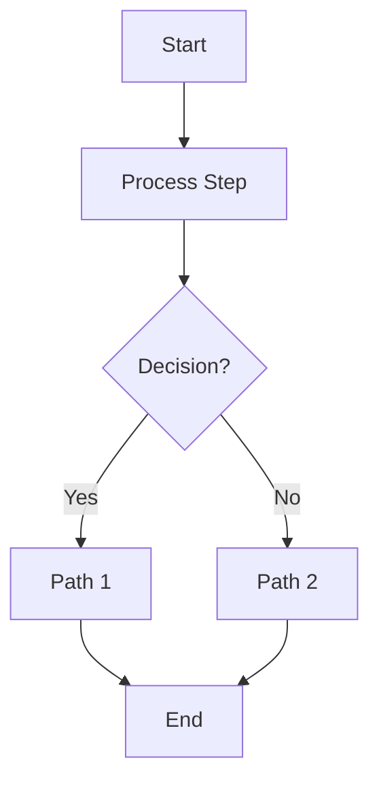
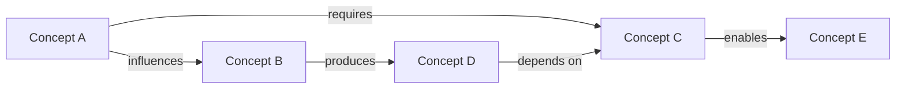
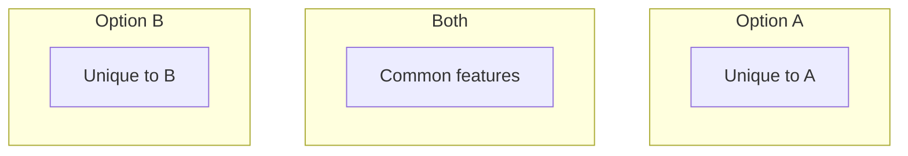
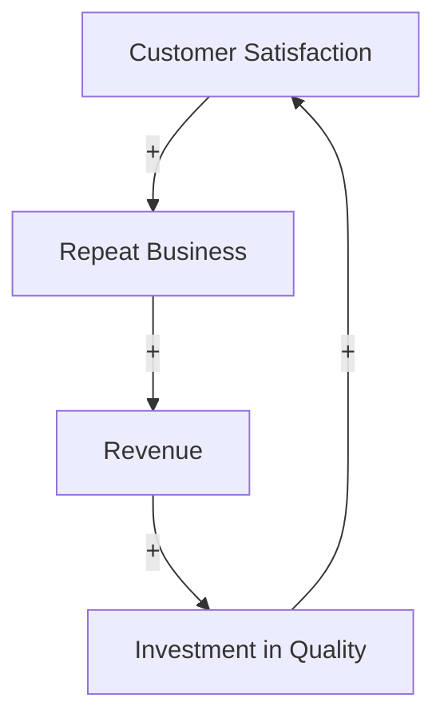
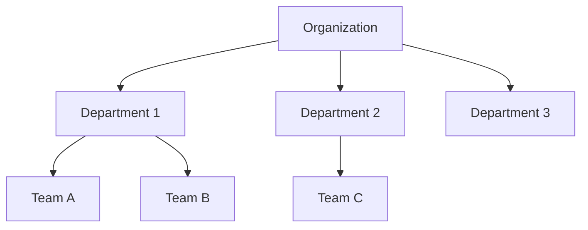
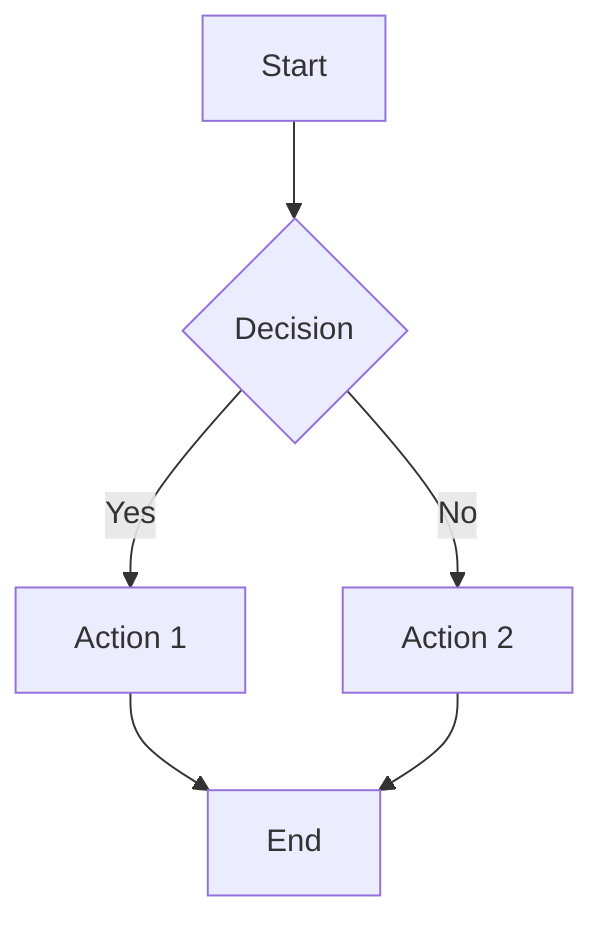

# Visualization Guide - Charts, Diagrams, and Visual Thinking

## Overview

This guide covers creating visualizations beyond mind maps and infographics—including flowcharts, concept maps, comparison charts, timelines, and other diagrams that clarify relationships and processes.

**Core principle**: Choose the right visualization for the information structure.

## Visualization Types

### Decision Framework

**Choose based on what you're showing**:

| Information Type | Best Visualization |
|-----------------|-------------------|
| Process/workflow | Flowchart |
| Relationships between concepts | Concept map |
| Comparing options | Comparison chart |
| Change over time | Timeline |
| Cause and effect | Causal diagram |
| Hierarchical structure | Tree diagram / Org chart |
| Cycles or systems | System diagram |
| Parts of whole | Breakdown diagram |
| Data trends | Line/bar charts |
| Distribution | Pie chart / histogram |

## Flowcharts

### Purpose
Show processes, decisions, and workflows with clear paths from start to finish.

### When to Use
- Documenting processes
- Decision trees
- Algorithms or logic
- Troubleshooting guides
- User flows

### Key Elements

**Shapes meaning**:
- **Rectangle**: Process step
- **Diamond**: Decision point
- **Oval**: Start/End
- **Parallelogram**: Input/Output
- **Circle**: Connector

**Flow direction**:
- Top to bottom (most common)
- Left to right
- Use arrows to show direction
- Label decision branches (Yes/No, True/False)

### Example Structure

```
[START]
   ↓
[Process Step 1]
   ↓
[Decision?] → No → [Alternative Path]
   ↓ Yes            ↓
[Process Step 2]   [Process Step 3]
   ↓                ↓
[END] ←─────────────┘
```

### Mermaid Format



### Best Practices

✅ **Do**:
- Keep steps concise (3-7 words)
- Label all decision branches clearly
- Use consistent shape meanings
- Show clear start and end points
- Maintain logical flow

❌ **Avoid**:
- Too many steps (break into sub-processes)
- Crossing lines (reorganize layout)
- Ambiguous decisions
- Missing branches
- Inconsistent direction

## Concept Maps

### Purpose
Show relationships between ideas, concepts, or entities with labeled connections.

### When to Use
- Brainstorming
- Knowledge mapping
- Showing complex relationships
- Theory visualization
- Learning frameworks

### Key Features

**Unlike mind maps**:
- Multiple connection types
- Cross-links between branches
- Relationship labels
- Network structure (not purely hierarchical)

### Example Structure

```
    [Concept A] ─"influences"→ [Concept B]
         │                          │
    "requires"                 "produces"
         │                          │
         ↓                          ↓
    [Concept C] ←──"depends on"─ [Concept D]
         │
    "enables"
         │
         ↓
    [Concept E]
```

### Mermaid Format



### Best Practices

✅ **Do**:
- Label relationships clearly
- Use directional arrows meaningfully
- Group related concepts
- Show key connections (not all possible ones)
- Maintain visual balance

❌ **Avoid**:
- Too many crossing lines
- Unlabeled connections
- Cluttered layout
- Trivial relationships
- Inconsistent directionality

## Comparison Charts

### Purpose
Show differences and similarities between options, approaches, or alternatives.

### When to Use
- Product comparisons
- Pros and cons analysis
- Feature matrices
- Decision making
- "Before vs. After"

### Format Options

#### Option 1: Side-by-Side Table

```
| Feature      | Option A | Option B | Option C |
|--------------|----------|----------|----------|
| Cost         | Low      | Medium   | High     |
| Speed        | Fast     | Medium   | Slow     |
| Complexity   | Simple   | Moderate | Complex  |
| Best for     | X users  | Y users  | Z users  |
```

#### Option 2: Venn Diagram



#### Option 3: Pros/Cons Split

```
Option A
├─ Pros
│  ├─ Pro 1
│  ├─ Pro 2
│  └─ Pro 3
└─ Cons
   ├─ Con 1
   └─ Con 2

Option B
├─ Pros
│  ├─ Pro 1
│  └─ Pro 2
└─ Cons
   ├─ Con 1
   ├─ Con 2
   └─ Con 3
```

### Best Practices

✅ **Do**:
- Use consistent criteria
- Provide context for comparisons
- Be objective
- Include relevant dimensions
- Highlight key differences

❌ **Avoid**:
- Comparing incomparable things
- Biased framing
- Too many dimensions
- Cherry-picking data
- Missing important criteria

## Timelines

### Purpose
Show chronological progression, historical development, or project phases.

### When to Use
- Project planning
- Historical narratives
- Process stages
- Roadmaps
- Career progression

### Format Options

#### Option 1: Linear Timeline

```
[Start]──────[Event 1]──────[Event 2]──────[Event 3]──────[End]
  T0           T1             T2             T3             T4
```

#### Option 2: Milestone Timeline

```
2020 ────●──────────────────── Foundation laid
          │
2021 ─────────●───────────────── First product
              │
2022 ─────────────●───────────── Market expansion
                  │
2023 ─────────────────●───────── Current state
```

#### Option 3: Phased Timeline

```
Phase 1 (Q1-Q2)         Phase 2 (Q3-Q4)         Phase 3 (Next Year)
├─ Research             ├─ Development          ├─ Launch
├─ Planning             ├─ Testing              ├─ Scale
└─ Design               └─ Refinement           └─ Optimize
```

### Best Practices

✅ **Do**:
- Use consistent time scale
- Mark significant milestones
- Show dependencies if relevant
- Include context
- Make timeline direction clear

❌ **Avoid**:
- Inconsistent spacing
- Too much detail
- Missing key events
- Unclear time markers
- Cluttered labels

## Causal Diagrams

### Purpose
Show cause-and-effect relationships, feedback loops, and system dynamics.

### When to Use
- Root cause analysis
- Systems thinking
- Problem diagnosis
- Impact analysis
- Strategy planning

### Key Elements

**Symbols**:
- **+**: Positive relationship (more A → more B)
- **-**: Negative relationship (more A → less B)
- **→**: Causal direction
- **⟲**: Feedback loop

### Example Structure

```
[Cause A] ─(+)→ [Effect B] ─(+)→ [Effect C]
                     │
                    (+)
                     │
                     ↓
                [Effect D] ─(-)→ [Cause A]
                                   ⟲
```

### Mermaid Format



### Best Practices

✅ **Do**:
- Clearly label relationships (+/-)
- Show feedback loops
- Identify leverage points
- Keep it focused
- Explain non-obvious connections

❌ **Avoid**:
- Too many variables
- Ambiguous relationships
- Missing feedback loops
- Unclear causation
- Correlation as causation

## Tree Diagrams

### Purpose
Show hierarchical relationships, classification, or breakdown of components.

### When to Use
- Organizational charts
- Classification systems
- Decision trees
- Component breakdowns
- Skill trees

### Example Structure

```
                    [Root]
                      │
          ┌───────────┼───────────┐
          │           │           │
      [Branch 1]  [Branch 2]  [Branch 3]
          │           │           │
      ┌───┴───┐   ┌───┴───┐   ┌───┴───┐
  [Leaf 1][Leaf 2][Leaf 3][Leaf 4][Leaf 5][Leaf 6]
```

### Mermaid Format



### Best Practices

✅ **Do**:
- Maintain consistent hierarchy levels
- Use clear parent-child relationships
- Balance the tree structure
- Label all nodes clearly
- Show complete structure

❌ **Avoid**:
- Unbalanced depth
- Orphan nodes
- Ambiguous relationships
- Too many levels (>5)
- Missing branches

## System Diagrams

### Purpose
Show how components interact within a system, including cycles and feedback.

### When to Use
- Architecture diagrams
- Process flows with feedback
- Ecosystem maps
- Business models
- Complex interactions

### Example Structure

```
     ┌──────────────────────┐
     │                      │
     ↓                      │
[Component A] → [Component B] → [Component C]
     ↑              ↓              │
     │         [Component D]       │
     │              ↑              │
     └──────────────┴──────────────┘
```

### Best Practices

✅ **Do**:
- Show key interactions
- Indicate feedback loops
- Label flow directions
- Group related components
- Show boundaries

❌ **Avoid**:
- Every possible connection
- Unclear flow direction
- Missing feedback loops
- Cluttered intersections
- Ambiguous boundaries

## Data Charts

### Purpose
Visualize quantitative data, trends, patterns, and distributions.

### Chart Type Selection

**Line Chart**:
- **Use for**: Trends over time, continuous data
- **Best for**: Showing change, patterns, trajectories

**Bar Chart**:
- **Use for**: Comparing quantities, discrete categories
- **Best for**: Side-by-side comparison, rankings

**Pie Chart**:
- **Use for**: Parts of a whole, proportions
- **Best for**: Simple distributions (3-5 categories max)

**Scatter Plot**:
- **Use for**: Relationships between variables, correlations
- **Best for**: Finding patterns, outliers, clusters

**Histogram**:
- **Use for**: Distribution of continuous data
- **Best for**: Frequency distribution, normal curves

### Chart Specifications

When describing data charts, include:

1. **Chart type** - Which visualization
2. **Axes** - What's on X and Y
3. **Data series** - What's being plotted
4. **Labels** - Titles, axis labels, legends
5. **Style** - Colors, markers, line styles
6. **Annotations** - Key points to highlight

### Example Specification

```markdown
Chart: Line chart showing productivity trends

X-axis: Months (January - December)
Y-axis: Productivity score (0-100)

Data series:
- Remote workers (blue line)
- Office workers (green line)
- Hybrid workers (orange line)

Key features:
- Mark intersection point at June
- Annotate remote worker spike in August
- Show trend lines
- Include data labels for max/min values

Style:
- Clean, minimal grid
- Bold lines, 2px width
- Markers at data points
- Legend in top-right
```

## Creating Visualizations from Content

### Process

1. **Identify information structure**
   - Sequential? → Flowchart or timeline
   - Hierarchical? → Tree or mind map
   - Networked? → Concept map or system diagram
   - Comparative? → Comparison chart
   - Quantitative? → Data chart

2. **Determine key relationships**
   - What connects to what?
   - What causes what?
   - What flows where?
   - What's grouped how?

3. **Choose visualization type**
   - Match structure to type
   - Consider audience
   - Fit platform constraints
   - Serve the purpose

4. **Specify details**
   - Elements and labels
   - Connections and flows
   - Visual hierarchy
   - Style and format

5. **Output format**
   - Mermaid code (if applicable)
   - Structured description
   - Plain text representation
   - Implementation notes

## Output Formats

### Format 1: Mermaid Code

**For supported diagrams** (flowcharts, concept maps, timelines):



**Advantages**:
- Can be rendered in many tools
- Clean, structured syntax
- Easy to modify
- Version-controllable

### Format 2: Text-Based Diagram

**For any visualization type**:

```
Process Flow: Content Creation

START
  ↓
Research Phase
  ├─ Gather sources
  ├─ Take notes
  └─ Identify insights
  ↓
Creation Phase
  ├─ Outline structure
  ├─ Write draft
  └─ Add examples
  ↓
Review Phase
  ├─ Self-edit
  ├─ Get feedback
  └─ Refine
  ↓
END
```

**Advantages**:
- Works for any diagram
- Readable as-is
- Copy-paste friendly
- Platform-independent

### Format 3: Detailed Description

**For complex visualizations**:

```markdown
## Visualization: System Dynamics of Remote Work

### Type
Causal loop diagram showing feedback relationships

### Components
1. Employee Autonomy (central)
2. Productivity
3. Trust from Management
4. Monitoring Systems
5. Employee Satisfaction

### Relationships
- Autonomy → (+) Productivity
- Productivity → (+) Trust
- Trust → (+) Autonomy [REINFORCING LOOP]
- Trust → (-) Monitoring
- Monitoring → (-) Autonomy [BALANCING LOOP]
- Autonomy → (+) Satisfaction
- Satisfaction → (+) Productivity [REINFORCING LOOP]

### Visual Presentation
- Place "Autonomy" in center
- Arrange others in circle around it
- Use green arrows for positive relationships
- Use red arrows for negative relationships
- Mark loops with circular indicators
- Annotate leverage point: "Trust"
```

**Advantages**:
- Comprehensive specification
- Clear implementation guide
- Flexibility in rendering
- Detailed explanations

## Best Practices Across All Visualizations

### Universal Principles

✅ **Clarity First**
- Every element serves a purpose
- Labels are clear and concise
- Flow/hierarchy is obvious
- Complexity is justified

✅ **Appropriate Complexity**
- As simple as possible
- As complex as necessary
- Break down if too complex
- Layer information if needed

✅ **Consistent Style**
- Similar elements look similar
- Visual language is consistent
- Colors have meaning
- Typography is coherent

✅ **Accessible Design**
- Not relying solely on color
- Text is readable
- Sufficient contrast
- Alternative descriptions available

✅ **Purpose-Driven**
- Serves specific goal
- Audience-appropriate
- Context-relevant
- Actionable if applicable

### Common Mistakes

❌ **Visualization Sins**:
- Too much information
- Decorative elements
- Inconsistent styling
- Poor labeling
- Unclear relationships
- Arbitrary colors
- Cluttered layout
- Missing legends
- Ambiguous flow
- Pointless complexity

## Working with Users

### Discovery Questions

When user requests visualization:

1. **What's the core message?**
   - What should viewers understand?
   - What's the key insight?

2. **What's the information structure?**
   - Sequential steps?
   - Hierarchical relationships?
   - Networked connections?
   - Comparative alternatives?

3. **Who's the audience?**
   - Experts or beginners?
   - Technical or general?
   - Internal or external?

4. **What's the use case?**
   - Presentation?
   - Documentation?
   - Social sharing?
   - Learning tool?

5. **Are there constraints?**
   - Platform limitations?
   - Size restrictions?
   - Color requirements?
   - Format needs?

### Refinement Process

1. **Create initial visualization**
2. **Present with rationale**
3. **Gather feedback**
4. **Adjust as needed**
5. **Provide multiple formats if helpful**

## Quality Checklist

Before finalizing any visualization:

**Content**:
- [ ] Shows key relationships clearly
- [ ] Information is accurate
- [ ] Appropriate level of detail
- [ ] Labels are clear and concise
- [ ] Purpose is achieved

**Structure**:
- [ ] Right visualization type
- [ ] Logical organization
- [ ] Clear flow or hierarchy
- [ ] Balanced layout
- [ ] No unnecessary complexity

**Style**:
- [ ] Consistent visual language
- [ ] Readable text
- [ ] Meaningful use of color
- [ ] Clean and professional
- [ ] Accessible design

**Usability**:
- [ ] Easy to understand
- [ ] Scannable quickly
- [ ] Usable at intended size
- [ ] Platform-appropriate
- [ ] Actionable if needed

## Remember

The best visualization is the one that makes complex information clear at a glance, reveals relationships that weren't obvious in text, and helps the audience understand or decide something they couldn't before.

**Visualization is a tool for thinking, not just presenting.**

Choose the visualization that best serves the information structure and the audience's needs. Sometimes text is clearer. Sometimes a simple diagram beats an elaborate one. Always let purpose drive design.
